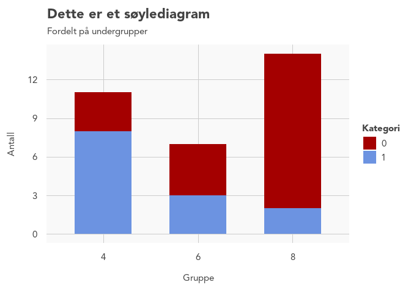

<!-- README.md is generated from README.Rmd. Please edit that file -->

# rrplot

<!-- badges: start -->

[](https://github.com/Riksrevisjonen/rrplot/actions/workflows/R-CMD-check.yaml)

<!-- badges: end -->

The purpose of rrplot is to provide auditors at OAG Norway with the
ability to quickly make beautiful graphs with ggplot2 that are in
accordance with official requirements.

## Installation

You can install the development version of rrplot from the local
repository with:

``` r
install.packages("rrplot2", repos = "https://cran.riksrevisjonen.no/latest") 
```

## Contents

### Main theme

Most of the adjustments to the graph aesthetics can be found in the
`theme_RR()` function. This is simply added as a layer in the ggplot
call.

### Custom wrappers for specific geoms

The package also contains custom wrappers for the following geom
functions in `ggplot2`:

- `geom_bar()` -\> `geom_bar_RR()`
- `geom_point()` -\> `geom_point_RR()`
- `geom_jitter()` -\> `geom_jitter_RR()`
- `geom_density()` -\> `geom_density_RR()`
- `geom_line()` -\> `geom_line_RR()`

These wrappers are also added as layers in the ggplot call, along with
`theme_RR()`. Note that `theme_RR()` needs to be placed **before** the
geom wrapper (see example below). Using the custom wrappers are
optional, but recommended.

### Color scales

The package contains functions to determine the color palette of your
graphs.

Discrete color palette functions:

- `scale_color_RR()`: Used when the **color** argument of `aes()` has
  been assigned.
- `scale_fill_RR()`: Used when the **fill** argument of `aes()` has been
  assigned.

These are added as separate layers in the ggplot call and contain 9
colors:

``` r
library(scales)
show_col(RR_pal()(9))
```


Continuous color palette functions:

- `scale_fill_continuous_RR_red`: Red continuous **fill** scale between
  `#fcb7b9` and `#a40000`
- `scale_fill_continuous_RR_blue` Blue continuous **fill** scale between
  `#b4c6e9` and `#001b61`
- `scale_color_continuous_RR_red` Red continuous **color** scale between
  `#fcb7b9` and `#a40000`
- `scale_color_continuous_RR_blue` Blue continuous **color** scale
  between `#b4c6e9` and `#001b61`

## Examples

This is a basic example which shows you how to create a bar chart:

``` r
library(ggplot2)
library(rrplot2)
#> Attaching system fonts
#> 
#> Attaching package: 'rrplot2'
#> The following objects are masked from 'package:rrplot':
#> 
#>     check_pal_n_RR, geom_bar_flipped_RR, geom_bar_RR, geom_density_RR,
#>     geom_jitter_RR, geom_line_RR, geom_point_RR, RR_pal,
#>     scale_color_continuous_RR_blue, scale_color_continuous_RR_red,
#>     scale_color_RR, scale_fill_continuous_RR_blue,
#>     scale_fill_continuous_RR_red, scale_fill_RR, theme_RR

mtcars |>
  ggplot(aes(x = factor(cyl),
             fill = factor(am))) +
  theme_RR() +
  geom_bar_RR() +
  labs(title = "Dette er et søylediagram",
       subtitle = "Fordelt på undergrupper",
       x = "Gruppe",
       y = "Antall",
       fill = "Kategori") +
  scale_fill_RR()
```



Note that `geom_bar_RR()` accepts the same arguments as `geom_bar()`.
Again, please note that `theme_RR()` needs to be placed **before** the
`geom_bar()` layer.

Another example, with a scatter plot:

``` r

iris |>
  ggplot(aes(x = Sepal.Length,
             y = Sepal.Width,
             color = Species)) +
  theme_RR() +
  geom_point_RR() +
  labs(title = "Scatterplot",
       subtitle = "Dette er en lenger beskrivelse over flere linjer\nsom gir leseren mer informasjon.",
       x = "X-variabel",
       y = "Y-variabel") +
  scale_color_RR()
```


